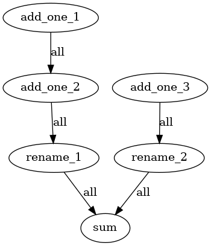

- Title: Drop `BaseComponent` and reimplement `Pipeline`.
- Decision driver: ZanSara
- Start Date: (today's date, in format YYYY-MM-DD)
- Proposal PR: (fill in after opening the PR)
- Github Issue or Discussion: (only if available, link the original request for this change)

# Summary

Haystack Pipelines are very powerful objects, but they still have a number of unnecessary limitations, by design and by implementation.

This proposal aims to address most of the implementation issues, some fundamental assumptions like the need for DAGs and the `BaseComponent` class, and proposes a solution for the question of `DocumentStore`'s status with respect to the `Pipeline`.


# Motivation

Pipelines are the fundamental component of Haystack and one of its most powerful concepts. At its core, a Pipeline is a DAG (Directed Acyclic Graph) of classes called Nodes, or Components, each of whom executes a specific transformation on the data flowing along the pipeline. In this way, users can combine powerful libraries, NLP models, and simple Python snippets to connect a herd of tools into a one single, coherent object that can fulfill an infinite variety of tasks.

However as it currently stands the Pipeline object is also imposing a number of limitations on its use, most of which are likely to be unnecessary. Some of these include:
- DAGs are safe, but loops could enable many more usecases, like `Agents`.
- `Pipeline` can select among branches, but cannot run such branches in parallel, except for some specific and inconsistent corner cases.
- `Pipeline`s are forced to have one single input and one single output node, and the input node has to be called either `Query` or `Indexing`, which disallows any other type of pipeline.
- The fixed set of allowed inputs (`query`, `file_paths`, `labels`, `documents`, `meta`, `params` and `debug`) disallows several usecases, like summarization pipelines, translation pipelines, even some sort of generative pipelines.
- `Pipeline`s are often required to have a `DocumentStore` _somewhere_ (see below), even in situation where it wouldn't be needed.
- The redundant concept of `run` and `run_batch()`: nodes should take care of this distinction internally if it's important, otherwise run in batches by default.
- The distinction between a `Pipeline` and its YAML representation is confusing: YAMLs can contain several pipelines, but `Pipeline.save_to_yaml()` can only save a single pipeline at time.

In addition, there are a number of known bugs that makes the current Pipeline implementation hard to work with. Some of these include:
- Branching and merging logic is known to be buggy.
- Nodes can't be added twice to the same pipeline in different locations, limiting their reusability.
- Pipeline YAML validation needs to happen with a schema because Pipelines can only be loaded along with all their nodes, which is a very heavy operation. Shallow or lazy loading of nodes doesn't exist.
- Being forced to use a schema for YAML validation makes impossible to validate the graph in advance.

On top of these issues, there is the tangential issue of `DocumentStore`s and their uncertain relationship with `Pipeline`s. This problem has to be taken into account during a redesign of `Pipeline` and, if necessary, `DocumentStore`s should also be partially impacted. Some of these issues include:
- `DocumentStore`s are nodes in theory, but in practice they can be added to `Pipeline`s only to receive documents to be stored. However `DocumentStore`'s most prominent usecase is as a _source_ of documents, and currently they are not suited for this task without going through an intermediary, most often a `Retriever` class.
  - The relationship between `DocumentStore` and `Retriever` should be left as a topic for a separate proposal but kept in mind, because Retrievers currently act as the main interface for `DocumentStore`s into `Pipeline`s.

This proposal tries to adress all the above point by taking a radical stance with:
- A full reimplementation of the `Pipeline` class that does limit itself to DAGs, can run branches in parallel, can prune branches, and can process loops.
- Dropping the concept of `BaseComponent` and introducing the concept of stateless `Action`s in its place.
- Define a clear and flexible contract between `Pipeline` and the `Action`s, along with a simplified contract to ease the learning curve.
- Define a clear place for `DocumentStore`s with respect to `Pipeline`s that does forcefully involve `Retriever`s.
- Redesign the YAML representation of `Pipeline`s.

# Basic example

A simple example of how the new Pipeline could look like is shown here. See the comments for an initial comment on the code; for the detailed explanation behind the design choices and all open questions, see the Detailed Design section.

```python
from typing import *
from pathlib import Path
from pprint import pprint

from new_haystack.pipeline import Pipeline
from new_haystack.actions import haystack_action, haystack_simple_action

# A basic Haystack Action. It takes:
#
# - name: its own name in the pipeline. Allows the action to find its own parameters in the
#     parameters dictionary (see below).
# - data: the input data flowing down the pipeline
# - parameters: a dict of dicts with all the parameters for all nodes flowing down the pipeline
#     Note that all nodes have access to all parameters for all other nodes: this might come handy
#     to nodes like Agents, that might want to influence the behavior of nodes downstream.
# - outgoing_edges: the name of the edges connected downstream of this action. Also useful mostly
#     for error messages and basic validation
# - stores: a dictionary of all the (Document)Stores connected to this pipeline.
#
# This function is supposed to return a tuple of dictionaries (data, parameters) along all edges
# that should run. Decision nodes might output on one edge only in order to prevent the unneede branch
# from running.
#
# The decorator is needed for this action to be recognized as a Haystack action.
#
@haystack_action
def rename_data(
    name: str,
    data: Dict[str, Any],
    parameters: Dict[str, Any],
    outgoing_edges: List[str],
    stores: Dict[str, Any],
):
    relevant_parameters = parameters.get(name, {})
    old_name = relevant_parameters["old_name"]
    new_name = relevant_parameters["new_name"]
    value = data.pop(old_name)
    return {edge: ({**data, new_name: value}, parameters) for edge in outgoing_edges}

#
# A simplified Haystack action. All parameters name are automatically extracted from
# the signature, looked for in the data and parameters dictionaries, and passed over 
# to this function. Their output will be merged to the rest of the data flowing down
# the pipeline. 
# 
# Simplified actions can only output the same values on all outgoing edges, don't know
# their names, can't access document stores and can't change any other node's parameters
# It's up to discussion whether any of the above limitations is too strict and how to
# design better APIs.
#
@haystack_simple_action
def add_one(value):
    return {"value": value + 1}


@haystack_simple_action
def sum(first, second):
    return {"sum": first + second}


pipeline = Pipeline()

# Nodes are added with a name and an action.
# Note the lack of references to any other node.
pipeline.add_node("add_one_1", add_one)
pipeline.add_node("add_one_2", add_one)
pipeline.add_node("add_one_3", add_one)

# Nodes can also accept a set of default parameters.
# They will override the functions's own default, if any,
# but they can be overwritten by new parameters if they are
# given to Pipeline.run() (see below)
pipeline.add_node("rename_1", rename_data, parameters="rename_1": {"old_name": "value", "new_name": "first"})
pipeline.add_node("rename_2", rename_data)
pipeline.add_node("sum", sum)

# Nodes are the connected in a chain with a separate call to Pipeline.connect()
pipeline.connect(["add_one_1", "add_one_2", "rename_1", "sum"])
pipeline.connect(["add_one_3", "rename_2", "sum"])
# Right now there's no Pipeline.disconnect(), but it can be discussed.

pipeline.draw("simple_pipeline.png")

# Pipeline run accepts data and parameters only. Such dictionaries can contain 
# anything, depending on what the first node of the pipeline requires.
# Pipeline does not validate the input in any way.
results = pipeline.run(
    data={"value": 1},
    parameters={
        "rename_2": {"old_name": "value", "new_name": "second"},
    }
)
assert results == {"first": 3, "second": 2, "sum": 5}
```

The result of `Pipeline.draw()`:




# Detailed design

This is the bulk of the proposal. Explain the design in enough detail for somebody
familiar with Haystack to understand, and for somebody familiar with the
implementation to implement. Get into specifics and corner-cases,
and include examples of how the feature is used. Also, if there's any new terminology involved,
define it here.

# Drawbacks

Look at the feature from the other side: what are the reasons why we should _not_ work on it? Consider the following:

- What's the implementation cost, both in terms of code size and complexity?
- Can the solution you're proposing be implemented as a separate package, outside of Haystack?
- Does it teach people more about Haystack?
- How does this feature integrate with other existing and planned features?
- What's the cost of migrating existing Haystack pipelines (is it a breaking change?)?

There are tradeoffs to choosing any path. Attempt to identify them here.

# Alternatives

What other designs have you considered? What's the impact of not adding this feature?

# Adoption strategy

If we implement this proposal, how will the existing Haystack users adopt it? Is
this a breaking change? Can we write a migration script?

# How we teach this

Would implementing this feature mean the documentation must be re-organized
or updated? Does it change how Haystack is taught to new developers at any level?

How should this feature be taught to the existing Haystack users (for example with a page in the docs,
a tutorial, ...).

# Unresolved questions

Optional, but suggested for first drafts. What parts of the design are still
TBD?
