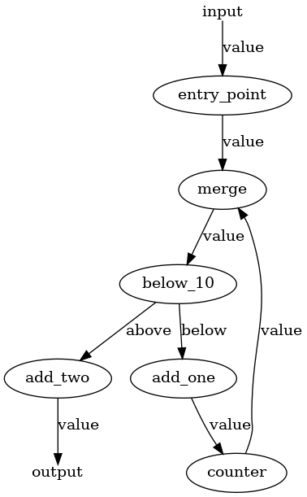

- Title: Drop `BaseComponent` and reimplement `Pipeline`.
- Decision driver: @ZanSara
- Start Date: (today's date, in format YYYY-MM-DD)
- Proposal PR: (fill in after opening the PR)
- Github Issue or Discussion: (only if available, link the original request for this change)

# Summary

Haystack Pipelines are very powerful objects, but they still have a number of unnecessary limitations, by design and by implementation.

This proposal aims to address most of the implementation issues, some fundamental assumptions like the need for DAGs and the `BaseComponent` class, and proposes a solution for the question of `DocumentStore`'s status with respect to the `Pipeline`.


# Motivation

Pipelines are the fundamental component of Haystack and one of its most powerful concepts. At its core, a Pipeline is a DAG (Directed Acyclic Graph) of objects called Nodes, or Components, each of whom executes a specific transformation on the data flowing along the pipeline. In this way, users can combine powerful libraries, NLP models, and simple Python snippets to connect a herd of tools into a one single, coherent object that can fulfill an infinite variety of tasks.

However, as it currently stands, the `Pipeline` object is also imposing a number of limitations on its use, most of which are likely to be unnecessary. Some of these include:

- DAGs. DAGs are safe, but loops could enable many more usecases, like `Agents`.

- `Pipeline` can select among branches, but cannot run such branches in parallel, except for some specific and inconsistent corner cases. For further reference and discussions on the topic, see:
    - https://github.com/deepset-ai/haystack/pull/2593
    - https://github.com/deepset-ai/haystack/pull/2981#issuecomment-1207850632
    - https://github.com/deepset-ai/haystack/issues/2999#issuecomment-1210382151

- `Pipeline`s are forced to have one single input and one single output node, and the input node has to be called either `Query` or `Indexing`, which softly forbids any other type of pipeline.

- The fixed set of allowed inputs (`query`, `file_paths`, `labels`, `documents`, `meta`, `params` and `debug`) blocks several usecases, like summarization pipelines, translation pipelines, even some sort of generative pipelines.

- `Pipeline`s are often required to have a `DocumentStore` _somewhere_ (see below), even in situation where it wouldn't be needed.
  - For example, `Pipeline` has a `get_document_store()` method which iterates over all nodes looking for a `Retriever`.

- The redundant concept of `run()` and `run_batch()`: nodes should take care of this distinction internally if it's important, otherwise run in batches by default.

- The distinction between a `Pipeline` and its YAML representation is confusing: YAMLs can contain several pipelines, but `Pipeline.save_to_yaml()` can only save a single pipeline.

In addition, there are a number of known bugs that makes the current Pipeline implementation hard to work with. Some of these include:

- Branching and merging logic is known to be buggy even where it's supported.
- Nodes can't be added twice to the same pipeline in different locations, limiting their reusability.
- Pipeline YAML validation needs to happen with a YAML schema because `Pipeline`s can only be loaded along with all their nodes, which is a very heavy operation. Shallow or lazy loading of nodes doesn't exist.
- Being forced to use a schema for YAML validation makes impossible to validate the graph in advance.

On top of these issues, there is the tangential issue of `DocumentStore`s and their uncertain relationship with `Pipeline`s. This problem has to be taken into account during a redesign of `Pipeline` and, if necessary, `DocumentStore`s should also be partially impacted. Some of these issues include:

- `DocumentStore`s are nodes in theory, but in practice they can be added to `Pipeline`s only to receive documents to be stored. On the other hand, `DocumentStore`'s most prominent usecase is as a _source_ of documents, and currently they are not suited for this task without going through an intermediary, most often a `Retriever` class.
  - The relationship between `DocumentStore` and `Retriever` should be left as a topic for a separate proposal but kept in mind, because `Retriever`s currently act as the main interface for `DocumentStore`s into `Pipeline`s.

This proposal tries to adress all the above point by taking a radical stance with:

- A full reimplementation of the `Pipeline` class that does not limit itself to DAGs, can run branches in parallel, can skip branches and can process loops safely.

- Dropping the concept of `BaseComponent` and introducing the much lighter concept of `Node` in its place.

- Define a clear contract between `Pipeline` and the `Node`s.

- Define a clear place for `DocumentStore`s with respect to `Pipeline`s that doesn't forcefully involve `Retriever`s.

- Redesign the YAML representation of `Pipeline`s.

# Basic example

A simple example of how the new Pipeline could look like is shown here. This example does not address `DocumentStore`s or YAML serialization, but rather focuses on the shift between `BaseComponent` and `Node`s.

For the detailed explanation behind the design choices and all open questions, see the "Detailed Design" section and the draft implementation here: https://github.com/ZanSara/haystack-2.0-draft 


```python
from typing import Dict, Any, List, Tuple
from new_haystack.pipeline import Pipeline
from new_haystack.nodes import haystack_node

# A Haystack Node. See below for details about this contract.
# Crucial components are the @haystack_node decorator and the`run()` method
@haystack_node
class AddValue:
    def __init__(self, add: int = 1, input_name: str = "value", output_name: str = "value"):
        self.add = add
        self.init_parameters = {"add": add}
        self.expected_inputs = [input_name]
        self.expected_outputs = [output_name]

    def run(
        self,
        name: str,
        data: List[Tuple[str, Any]],
        parameters: Dict[str, Any],
        stores: Dict[str, Any],
    ):
        add = parameters.get(name, {}).get("add", self.add)
        for _, value in data:
            value += add
        return ({"value": value}, )


@haystack_node
class Double:
    def __init__(self, input_edge: str = "value"):
        self.init_parameters = {"input_edge": input_edge}
        self.expected_inputs = [input_edge]
        self.expected_outputs = [input_edge]

    def run(
        self,
        name: str,
        data: List[Tuple[str, Any]],
        parameters: Dict[str, Any],
        stores: Dict[str, Any],
    ):
        for _, value in data:
            value *= 2
        return ({self.expected_outputs[0]: value}, )


# Pipelines can be instructed about where to search for nodes.
# By default they look in the entire sys.modules (a behavior similar to the old BaseComponent).
pipeline = Pipeline(search_nodes_in=[__name__])

# Nodes can be initialized as standalone objects.
# These instances can be added to the Pipeline in several places.
addition = AddValue(add=1)

# Nodes are added with a name and an node. Note the lack of references to any other node.
pipeline.add_node("first_addition", addition, parameters={"add": 3})  # Nodes can store default parameters per node.
pipeline.add_node("second_addition", addition)  # Note that instances can be reused
pipeline.add_node("double", Double())

# Nodes are the connected in a chain with a separate call to Pipeline.connect()
pipeline.connect(["first_addition", "double", "second_addition"])

pipeline.draw("pipeline.png")

# Pipeline.run() accepts 'data' and 'parameters' only. Such dictionaries can contain 
# anything, depending on what the first node(s) of the pipeline requires.
# Pipeline does not validate the input: the first node(s) should do so.
results = pipeline.run(
    data={"value": 1},
    parameters = {"second_addition": {"add": 10}}   # Parameters can be passed at this stage as well
)
assert results == {"value": 18}
```

The result of `Pipeline.draw()`:


# Detailed design

This section focuses on the concept rather than the implementation strategy. For a discussion on the implementation, see the draft here: https://github.com/ZanSara/haystack-2.0-draft 

## The Pipeline API

These are the core features that drove the design of the revised Pipeline API:
- An execution graph that is more flexible than a DAG.
- A clear place for `DocumentStore`s
- Shallow/lazy loading of nodes to enable easy validation

Therefore, the revised Pipeline object has the following API:

- Core functions:
    - `run(data, parameters)`: the core of the class. Relies on `networkx` for most of the heavy-lifting. Check out the implementation (https://github.com/ZanSara/haystack-2.0-draft/blob/main/new-haystack/new_haystack/pipeline/pipeline.py) for details: the code is heavily commented on the main loop and on the handling of non-trivial execution paths like branch selection, parallel branch execution, loops handling, multiple input/output and so on.
    - `draw(path)`: as in the old Pipeline object. Based on `pygraphviz` (which requires `graphviz`), but we might need to look for pure Python alternatives based on Matplotlib to reduce our dependencies.
- Graph building:
    - `add_node(name, node, parameters)`: adds a disconnected node to the graph. It expects Haystack nodes in the `node` parameter and will fail if they aren't respecting the contract. See below for a more detailed discussion of the Nodes' contract.
    - `get_node(name)`: returns the node's information stored in the graph
    - `connect(nodes)`: chains a series of nodes together. It will fail if the nodes inputs and outputs do not match: see the Nodes' contract to understand how Nodes can declare their I/O.
- Docstore management:
    - `connect_store(name, store)`: adds a DocumentStore to the stores that are passed down to the nodes through the `stores` variable.
    - `list_stores()`: returns all connected stores.
    - `get_store(name)`: returns a specific document store by name.
    - `disconnect_store(name, store)`: removes a store from the registry.
- Serialization and validation:
    - `__init__(path=None)`: if a path is given, loads the pipeline from the YAML found at that path. Note that at this stage `Pipeline` will collect nodes from all imported modules (see the implementation - the search can be scoped down to selected modules) and **all nodes' `__init__` method is called**. Therefore, `__init__` must be lightweight. See the Node's contract to understand how heavy nodes should design their initialization.
    - `save(path)`: serializes and saves the pipeline as a YAML at the given path.

Example pipeline topologies supported by this new implementation (images taken from the test suite):

<details>
<summary>Merging pipeline</summary>


In this pipeline, several nodes send their input into a single output node. Note that this pipeline has several starting nodes, something that is currently not supported by Haystack's `Pipeline`.

</details>


<details>
<summary>Branching pipeline with branch skipping</summary>


In this pipeline, only one edge will run depending on the decision taken by the `remainder` node. Note that this pipeline has several terminal nodes, something that is currently not supported by Haystack's `Pipeline`.

</details>


<details>
<summary>Branching pipeline with parallel branch execution</summary>


In this pipeline, all the edges that leave `enumerate` are run by `Pipeline`. Note that this usecase is currently not supported by Haystack's `Pipeline`.

</details>


<details>
<summary>Branching pipeline with branch skipping and merge</summary>


In this pipeline, the merge node can understand that some of its upstream nodes will never run (`remainder` selects only one output edge) and waits only for the inputs that it can receive, so one from `remainder`, plus `no-op`.

</details>


<details>
<summary>Looping pipeline</summary>



This is a pipeline with a loop and a counter that statefully counts how many times it has been called.

Note that the new `Pipeline` can set a maximum number of allowed visits to nodes, so that loops are eventually stopped if they get stuck.

</details>


<details>
<summary>Looping pipeline with merge</summary>


This is a pipeline with a loop and a counter that statefully counts how many times it has been called. There is also a merge node at the bottom, which shows how Pipeline can wait for the entire loop to exit before running `sum`.

</details>


<details>
<summary>Arbitrarily complex pipeline</summary>


This is an example of how complex Pipelines the new objects can support. This pipeline combines all cases above:
- Multiple inputs
- Multiple outputs
- Decision nodes and branches skipped due to a selection
- Distribution nodes and branches executed in parallel
- Merge nodes where it's unclear how many edges will actually carry output
- Merge nodes with repeated inputs ('sum' takes three `value` edges) or distinct inputs ('diff' takes `value` and `sum`)
- Loops along a branch
</details>

## The Node contract

Nodes can be of two types: stateless and stateful. They follow a similar contract.

### Stateless Node

```python
@haystack_node
def my_stateless_node(
    name: str,
    data: Dict[str, Any],
    parameters: Dict[str, Dict[str, Any]],
    outgoing_edges: List[str],
    stores: Dict[str, Any],
):
    my_own_parameters = parameters.get(name, {})

    ... some code ...

    return {edge: (data, parameters) for edge in outgoing_edges}
```

This is the contract for a stateless Haystack Node. It takes:

- `name: str`: the name of the node that is running it. Allows the node to find its own parameters in the parameters dictionary (see below).
- `data: Dict[str, Any]`: the input data flowing down the pipeline.
- `parameters: Dict[str, Dict[str, Any]]`: a dict of dicts with all the parameters for all nodes flowing down the pipeline. Note that all nodes have access to all parameters for all other nodes: this might come handy to nodes like `Agent`s, that might want to influence the behavior of nodes downstream.
- `outgoing_edges`: the name of the edges connected downstream of this node. Mostly useful for decision nodes, for error messages and basic validation
- `stores`: a dictionary of all the (Document)Stores connected to this pipeline.

This function is supposed to return a tuple of dictionaries `(data, parameters)` along all edges that should run. Decision nodes should output on selected edges only, in order to prevent the deselected branches from running.

The decorator is needed for this node to be recognized as a Haystack node.

### Stateful Node

```python
@haystack_node
class Counter:

    def __init__(self, start_from: int = 0):
        self.counter = start_from
        self.init_parameters = {"start_from": start_from}

    def run(
        self,
        name: str,
        data: Dict[str, Any],
        parameters: Dict[str, Any],
        outgoing_edges: Set[str],
        stores: Dict[str, Any],
    ):
        self.counter += 1
        return {edge: (data, parameters) for edge in outgoing_edges}

    @staticmethod
    def validate(init_parameters: Dict[str, Any]) -> None:
        if init_parameters.get("start_from", 0) < 0:
            raise NodeError("We count only positive numbers here.")
```

This is the contract for a stateful Haystack Node. 

Note how the `run()` method follows an identical contract than a stateless node: however, the decorator should be placed on top of the class.

The `__init__` method is optional and can take an arbitrary number of parameters. However there are two requirements:
- The init parameters need to be serializable for the `Pipeline.save()` method to work.
- All relevant init parameters need to be manually added to the `self.init_parameters` attribute. Failure to do so means that missing parameters won't be serialized.

The `validate()` method is also optional. Must be `@staticmethod` to allow validation to be performed on cold pipelines.

### Simplified Nodes

```python
@haystack_simple_node
def node(value, add):
    return {"value": value + add}
```
     
In simplified Haystack nodes, all parameters name are automatically extracted from the signature, looked for in the `data` and `parameters` dictionaries, and passed over to this function. Their output will be merged to the rest of the data flowing down the pipeline, overwriting any value already present under the same key.

Simplified nodes have a series of limitations due to their extremely simplified contract:
- They can only output the same values on all outgoing edges
- They don't know their names
- They can't access document stores
- They can't change any other node's parameters

Most of the above limitations are arbitrary and set in order to minimize the impact on the contract on the layout of
the function. Some intermediate simplifications can be designed along this one, for example:
- A simplified node taking also the `stores` variable to access the stores registry, like:
```python
@haystack_simple_node_with_stores
def node(value, add, stores):
    return {"value": value + add}
```
- A simplified node that can return primitives instead of dictionaries and specify the output key in the decorator, like:
```python
@haystack_very_simple_node(output_name="value")
def node(value, add):
    return value + add
```
- Simplified decision nodes, like:
```python
@haystack_decision
def node(value, threshold):
    if value > threshold:
        return "above"  # name of the selected edge: all the data flows down unchanged
    return "below"
```
and so on.

** Bonus: Why `run()` and not `__call__()`? **

Internally, both `@haystack_node` and `@haystack_simple_node` map `run()` to `__call__()` to simplify the job of `Pipeline.run()`. However, the simplified contract wraps the `run()` method heavily, destroying its original signature. To keep the original `run()` method usable outside of `Pipeline`s, the decorator assigns the wrapped version to `__call__()` to leave `run()` untouched. See the (arguably very scary) implementation of `@haystack_simple_node` if you want a headache or just love second-order functions wrapping multiple dunder class methods all at once.

TODO: `@haystack_simple_node` works amazingly, but needs a better implementation.


### Nodes discovery logic

Currently, at init time `Pipeline` scans the entire `sys.modules` looking for any function or class which is decorated with the `@haystack_node` decorator (or `@haystack_simple_node` and other similar simplifiers). 

Such search can be scoped down or directed elsewhere by setting the `search_nodes_in` init parameter in `Pipeline`: however, all modules must be imported for the search to be successful. 

Search also might fail in narrow corner cases: for example, inner functions are not discovered (often the case in tests). For these scenarios, `Pipeline` also accepts a `extra_nodes` init parameter that allows users to explicitly provide a dictionary of nodes to integrate with the other discovered nodes.

Name collisions are handled by prefixing the node name with the name of the module it was imported from.

See the draft implementation for details. 

### YAML representation

TO BE DEFINED - the implementation in the draft is just stubbed and by no means representative of the desired outcome.

### Distinction between a Pipeline and a (Bundle? Blueprint? Manifest? Project? Schematic? Let's find a good name)

Bundles are tiny wrappers on top of a set of pipelines, little more than dictionaries containing several pipelines.

However, they can contain nodes or stores that are shared across different pipelines and pass them over when they're initialized.

They also have `warm_up` and `cool_down` methods, which simply mirror the pipeline's.


# Open questions

- YAML representation
- Name for the group of Pipeline
- Which "simplified contracts" we want to implement

# Drawbacks

There are a number of drawbacks about the proposed approach:

- Migration is going to be far from straightforward for us. Although many nodes can probably work with minor adaptations into the new system, it would be beneficial for most of them to be reduced to their `run()` method, especially indexing nodes. This means nodes need, at least, to be migrated one by one to the new system and code copied over.
- Migration is going to be far from straightforward for the users: see Adoption strategy.
- This system allows for pipelines with more complex topologies, which brings the risk of more corner cases. `Pipeline.run()` must be made very solid in order to avoid this scenario.
- Stateless nodes need less upfront validation, but might more easily break while running due to unexpected inputs. While well designed nodes should internally check and deal with such situations, we might face larger amount of bugs due to our failure at spotting lack of checks for unexpected inputs at review time.
- The entire system work on the assumption that nodes are well behaving and respect both the contract and a number of "unspoken rules", like not touching other node's parameters unless necessary, pop their own input instead of letting it flow down the pipeline, etc. Malicious or otherwise "rude" nodes can wreak havoc in `Pipeline`s very easily by messing with other node's parameters and inputs.

# Adoption strategy

Old and new Pipeline, Nodes and nodes are going to be, in most cases, fully incompatible.

We must provide a migration script that can convert their existing pipeline YAMLs into the new ones.

This proposal is best thought as part of the design of Haystack 2.0, where we can afford drastic API changes such as this.

Adoption for dC: still an open question.
